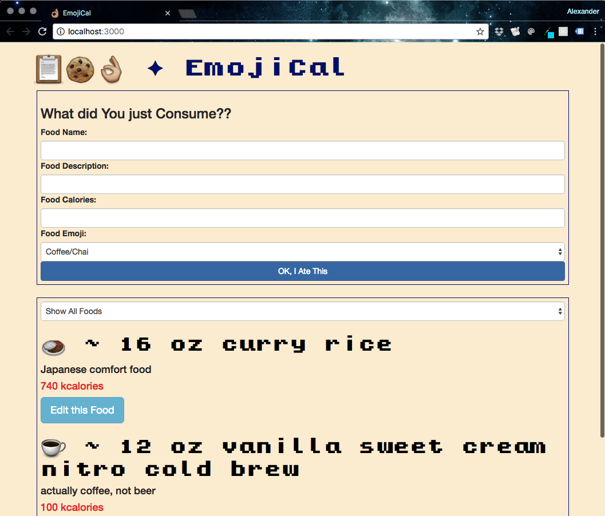

# EmojiCal :clipboard::cookie::ok_hand:
## _a meal tracker web app in Angular 2_
_Epicodus, October 2016_
### By _Alexander Jacks_



### Description
EmojiCal allows a user to input meal information for one day, and sort by calorie counts. User can edit food items after input.

## Setup
1. Clone/download this project directory
2. Open terminal in your project directory
3. $```npm install gulp && npm install bower && gem install sass && npm install typescript```
4. $```npm install && bower install```
5. $```gulp build && gulp serve```

## User Stories
- I want to log a food I have eaten by submitting a form with food name, calories and details.
- I want to view a list of foods I have logged.
- I want options to view all foods, only high-calorie foods (more than 500 calories), or only lower-calorie foods (less than 500 calories).
- I want to click a food to edit its name, details or calories (in case I decide to pretend my fries were 100 calories instead of 365).


## Known Issues
None at this time.


## Technologies Used
- Development: Angular2, TypeScript, Node.js
- Configuration: npm, Bower, Gulp
- Design: Bootstrap 3, Sass
- Testing: JSHint, Chrome

### Support and contact details
_Contact alexd (dot) jacks (at) gmail (dot) com with questions regarding this software.
Check out some of these resources to understand the technologies:_
- _learnhowtoprogram.com_
- _freecodecamp.com_
- _w3schools.com_
- _getbootstrap.com_

### Legal
ISC License

Copyright (c) [2016], [Alexander Jacks]

Permission to use, copy, modify, and/or distribute this software for any purpose with or without fee is hereby granted, provided that the above copyright notice and this permission notice appear in all copies.

THE SOFTWARE IS PROVIDED "AS IS" AND THE AUTHOR DISCLAIMS ALL WARRANTIES WITH REGARD TO THIS SOFTWARE INCLUDING ALL IMPLIED WARRANTIES OF MERCHANTABILITY AND FITNESS. IN NO EVENT SHALL THE AUTHOR BE LIABLE FOR ANY SPECIAL, DIRECT, INDIRECT, OR CONSEQUENTIAL DAMAGES OR ANY DAMAGES WHATSOEVER RESULTING FROM LOSS OF USE, DATA OR PROFITS, WHETHER IN AN ACTION OF CONTRACT, NEGLIGENCE OR OTHER TORTIOUS ACTION, ARISING OUT OF OR IN CONNECTION WITH THE USE OR PERFORMANCE OF THIS SOFTWARE.

*2016, 2017 AJ*
